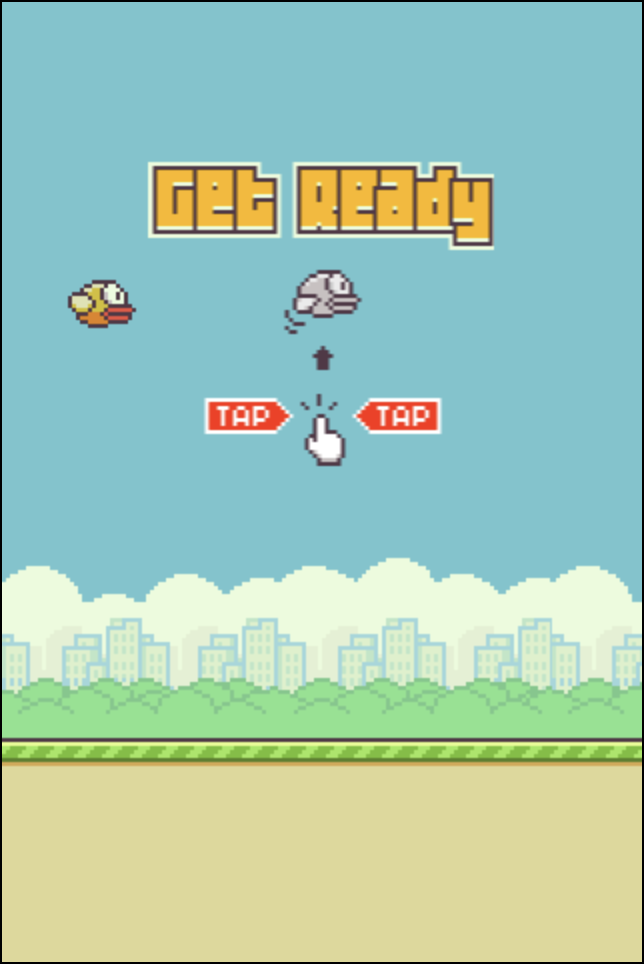
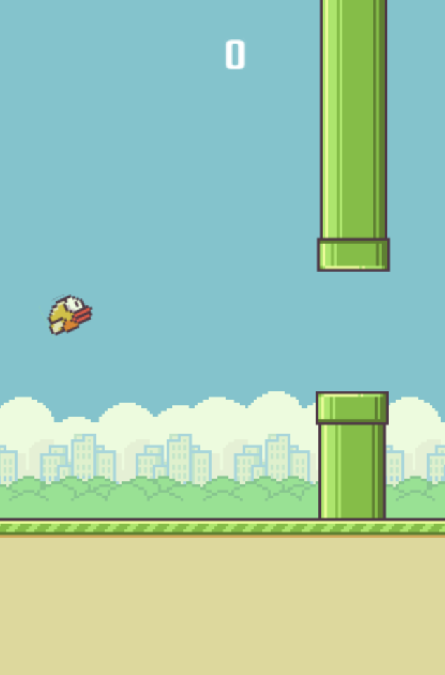
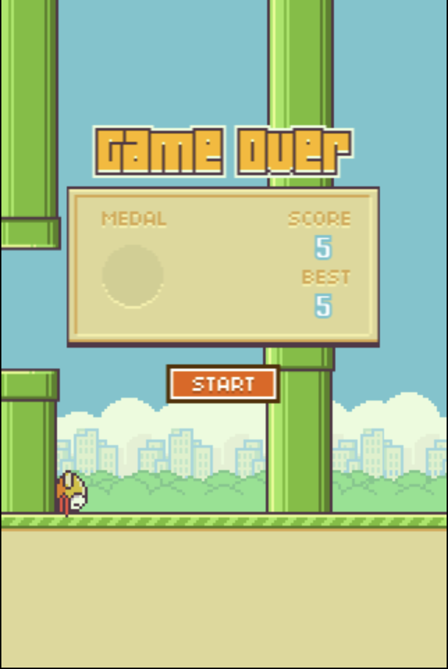

# Flappy-bird-JavaScript

### Flappy bird game using Vanilla JavaScript and HTML (HTML5 canvas).

#### Module Used.

#### Hosted on : [Netlify](https://flappyjs.netlify.app/)
#### Tutorial followed: [Code Explained](https://youtu.be/0ArCFchlTq4)

#### About the original
Flappy Bird was a side-scrolling mobile game featuring 2D retro style graphics.

